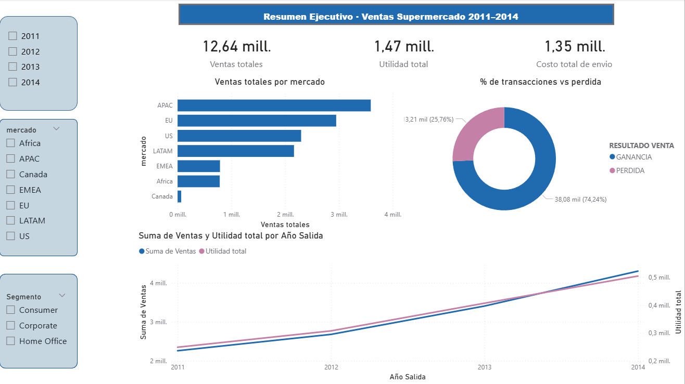
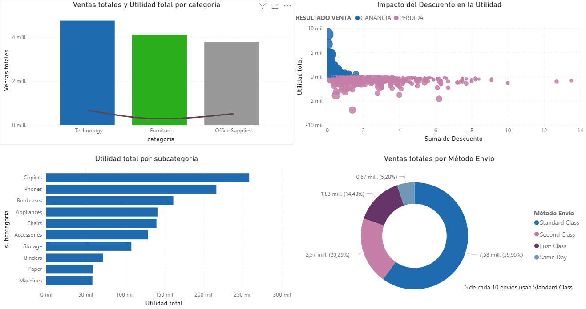
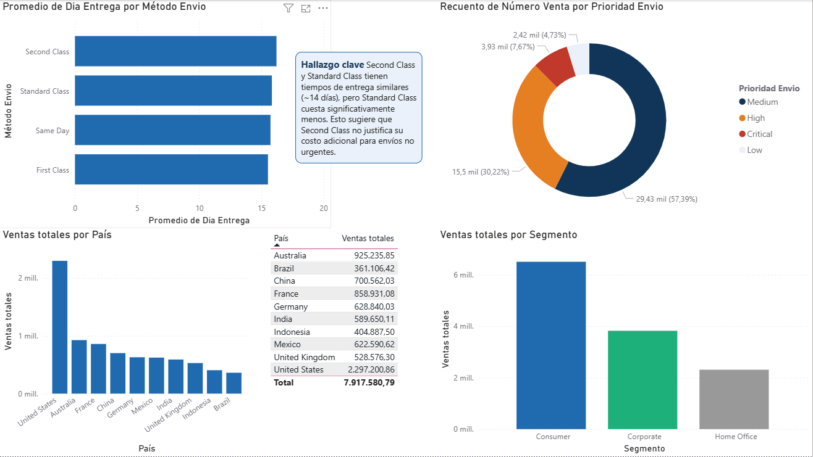

# 📊 Dashboard de Ventas Supermercado 2011–2014
### Análisis ejecutivo de ventas, rentabilidad y logística de envíos en Power BI

---

## 📌 Objetivo

Analizar el comportamiento de ventas, rentabilidad y eficiencia logística de un supermercado global durante el período 2011–2014, identificando patrones clave que permitan tomar decisiones estratégicas sobre productos, mercados y métodos de envío.

---

## 📂 Estructura del repositorio

```
dashboard-supermercado/
│
├── images/
│   ├── pagina1_resumen.png      # Página 1 – Resumen Ejecutivo
│   ├── pagina2_productos.png    # Página 2 – Análisis de Productos y Categorías
│   └── pagina3_clientes.png     # Página 3 – Análisis de Clientes y Envíos
│
├── Ventas_Supermercado.xlsx  # Dataset fuente
└── README.md
```

---

## 🗂️ Dataset

| Característica | Detalle |
|---|---|
| Fuente | Dataset público de supermercado global |
| Registros | 51.290 transacciones |
| Período | 2011 – 2014 |
| Mercados | Africa, APAC, EMEA, EU, US, LATAM, Canada |
| Categorías | Furniture, Office Supplies, Technology |
| Segmentos | Consumer, Corporate, Home Office |

**Variables principales:** Ventas, Utilidad, Descuento, Costo de Envío, Método de Envío, Prioridad, País, Región, Categoría, Subcategoría, Segmento de Cliente.

---

## 🔧 Herramientas utilizadas


- **Power BI Desktop** — modelado de datos, medidas DAX y visualizaciones interactivas
- **Excel avanzado** — limpieza, estructuración y análisis previo del dataset
- **DAX** — medidas calculadas para KPIs de ventas, utilidad, margen y días de entrega

---

## 📐 Metodología

1. **Limpieza y preparación** — revisión de tipos de dato, columnas calculadas (días de entrega, resultado ganancia/pérdida) y relaciones entre tablas en Power Query
2. **Modelado** — creación de medidas DAX para KPIs principales
3. **Análisis exploratorio** — identificación de tendencias por año, mercado, categoría y segmento
4. **Visualización** — dashboard de 3 páginas con filtros interactivos por año, mercado y segmento
5. **Comunicación de hallazgos** — redacción de insights clave en cada página

---

## 📈 Hallazgos principales

- 📉 **Los descuentos superiores al 20% generan pérdida** en la mayoría de transacciones — el scatter plot de descuento vs utilidad revela una correlación negativa clara entre ambas variables
- 📦 **Second Class y Standard Class tienen tiempos de entrega similares (~14 días)** pero costos diferentes, lo que sugiere que Second Class no justifica su precio adicional para envíos no urgentes
- 🌍 **APAC y EU son los mercados de mayor volumen de ventas**, concentrando más del 50% de las transacciones totales
- 📊 **Technology es la categoría con mayor utilidad**, seguida de Office Supplies — Furniture presenta los márgenes más bajos
- 📈 **Tendencia de crecimiento sostenida 2011–2014** tanto en ventas como en utilidad, con una brecha estable entre ambas métricas
- ✅ **El 74.24% de las transacciones son rentables** — el 25.76% restante representa una oportunidad de optimización de política de descuentos

---

## 🖥️ Vista previa del dashboard

### Página 1 — Resumen Ejecutivo
> KPIs globales, ventas por mercado, tendencia anual y distribución de rentabilidad



---

### Página 2 — Análisis de Productos y Categorías
> Ventas y utilidad por categoría, top subcategorías, impacto del descuento y métodos de envío



---

### Página 3 — Análisis de Clientes y Envíos
> Ventas por país y segmento, tiempos de entrega por método y distribución de prioridad



---

## 🧮 Medidas DAX principales

```dax
Ventas Totales = SUM('Ventas Supermercado'[Ventas])

Utilidad Total = SUM('Ventas Supermercado'[Utilidad])

% Margen = DIVIDE([Utilidad Total], [Ventas Totales], 0)

Promedio Días Entrega = AVERAGE('Ventas Supermercado'[dias transcurridos])

% Transacciones Ganancia =
DIVIDE(
    COUNTROWS(FILTER('Ventas Supermercado',
    'Ventas Supermercado'[RESULTADO VENTA] = "GANANCIA")),
    COUNTROWS('Ventas Supermercado'),
    0
)
```

---

## 💡 Conclusiones y recomendaciones

1. **Revisar la política de descuentos** — los datos muestran que descuentos por encima del 20% comprometen la rentabilidad. Se recomienda establecer un tope del 15-20% como límite operativo.

2. **Optimizar el uso de Second Class** — dado que sus tiempos de entrega son similares a Standard Class pero con mayor costo, se recomienda migrar envíos no urgentes a Standard Class para reducir costos logísticos.

3. **Priorizar inversión en Technology** — es la categoría con mejor margen. Aumentar el mix de productos tecnológicos puede mejorar la rentabilidad global.

4. **Enfocar estrategia comercial en APAC y EU** — son los mercados de mayor volumen y con tendencia de crecimiento sostenida durante los 4 años analizados.

---

## 👤 Autor

**Nelson David Quintana Vargas**
Analista de Datos | Business Intelligence

[](https://github.com/SeathWR)
[](https://linkedin.com/in/)

---

*Proyecto desarrollado como parte del portafolio de análisis de datos — 2025*
